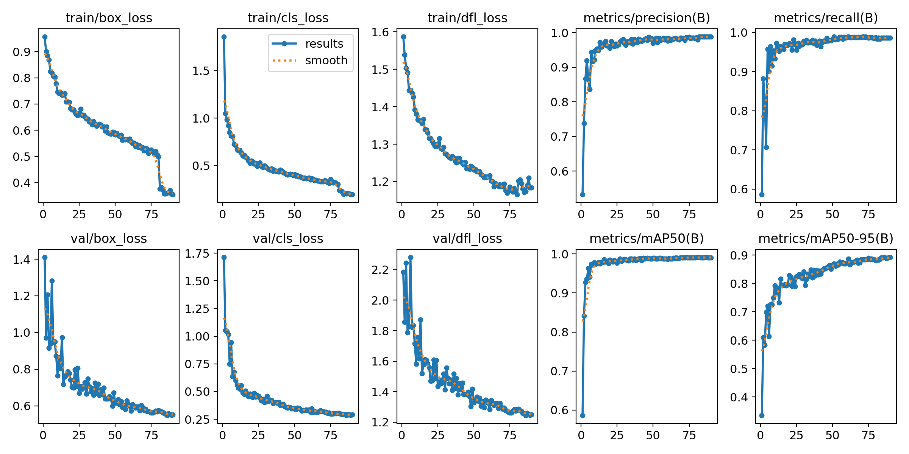

# 🇹🇷 Türk Lirası Banknot Tanıma Sistemi (YOLOv8s)

Bu proje, derin öğrenme temelli nesne algılama algoritmaları kullanılarak Türk Lirası banknotlarını gerçek zamanlı olarak tanımak için geliştirilmiştir. Model, farklı ışık koşullarında ve açılarda yüksek doğrulukla çalışacak şekilde optimize edilmiştir.
*  Yapay Zeka Uygulamaları dersi kapsamında proje ödevi olarak geliştirilmiştir.Türk Lirasi banknot paralarını tespit etmek üzerine yolov8s.pt modeli eğitilmiştir.

## 📝 Proje Bilgileri

* **Proje Amacı:** Görme engellilere yardımcı olması için temel bir para tanıma modülü oluşturmak.
* **Model Mimarisi:** YOLOv8s (Small) - Hız ve doğruluk dengesi nedeniyle tercih edilmiştir.
* **Geliştirici:** Ümit Rençber

## 📊 Veri Seti Detayları

* **Veri Seti Kaynağı:** Kaggle: https://www.kaggle.com/datasets/baltacifatih/turkish-lira-banknote-dataset
* **Etiketleme Yöntemi:** Roboflow : https://app.roboflow.com/bankot-para-tanma
* **Etiket Formatı:** YOLO PyTorch (txt)
* **Sınıflar:**
1. 5 
2. 10 
3. 20 
4. 50 
5. 100 
6. 200 

### Veri Dağılımı


* **Eğitim (Train):** 1697 
* **Doğrulama (Val):** 360
* **Test:** 359 
* **Toplam:** 2416 

## ⚙️ Eğitim Parametreleri,Süresi ve Performans

Modelin eğitildiği ortam ve hiper-parametre ayarları:

### Eğitim Parametreleri

* **Epoch:** 90
* **Batch Size:** 8
* **Image Size:** 704
* **Optimizer:** AdamW
* **Learning Rate:** 0.001


### Eğitim Süresi ve Performans

* **Toplam Eğitim Süresi:** 2 saat 8 dakika
* **En İyi mAP Değeri:**
* **Precision/Recall:**


## 💻 Donanım Bilgileri

* **İşletim Sistemi (OS):** Windows 11 Home
* **işlemci (CPU):** Intel i7-12700H
* **Ekran Kartı (GPU):** NVIDIA RTX 3050 4GB
* **RAM:** 16GB
* **Depolama:** 512GB


## 🛠 Kullanılan Yazılım ve Kütüphaneler

* **Python 3.10.11**
* **YOLOv8 (Ultralytics)**
* **OpenCV** (Görüntü işleme ve görselleştirme)
* **Tkinter** (Dosya seçimi arayüzü)

---
## 🚀 Kurulum ve Çalıştırma

1. **Gereksinimleri Yükleyin:**
```bash
pip install -r requirements.txt

```


2. **Uygulamayı Başlatın:**(Yada turk_lirasi_bankot.bat dosyası üzerinden otomatik çalıştırın)
```bash
python turk_lirasi_bankot.py

```


## 📂 Dosya Yapısı

* `turk_lirasi_bankot.py`: Tahmin, video işleme ve kamera arayüzünü yöneten ana script.
* `turk_lirasi_bankot.bat`: Scripti(`turk_lirasi_bankot.py`) cmd üzerinden çalıştırmaya yarar.
* `best.pt`: Eğitim sonucunda elde edilen en başarılı ağırlık dosyası.(Eğitilen model)
* `requirements.txt`: Projenin çalışması için gerekli minimal kütüphane listesi.

## 📈 Model Performansı ve Metrikler



[📥 Tüm eğitim verilerini içeren results.csv dosyasını görüntülemek için tıklayın](./yolov8s_banknot_modeli5-AdamW-704-90epoch/results.csv)


